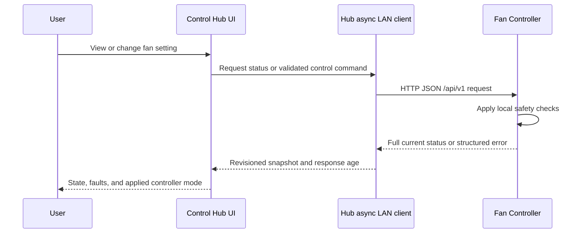

# Fan controller interaction flow

```mermaid
sequenceDiagram
  participant U as User
  participant H as Control Hub UI
  participant C as Hub async LAN client
  participant F as Fan Controller
  U->>H: View or change fan setting
  H->>C: Request status or validated control command
  C->>F: HTTP JSON /api/v1 request
  F->>F: Apply local safety checks
  F-->>C: Full current status or structured error
  C-->>H: Revisioned snapshot and response age
  H-->>U: State, faults, and applied controller mode
```

If the fan controller, Wi-Fi, or request times out, Control Hub marks data stale. The fan controller continues its own local thermal logic.
